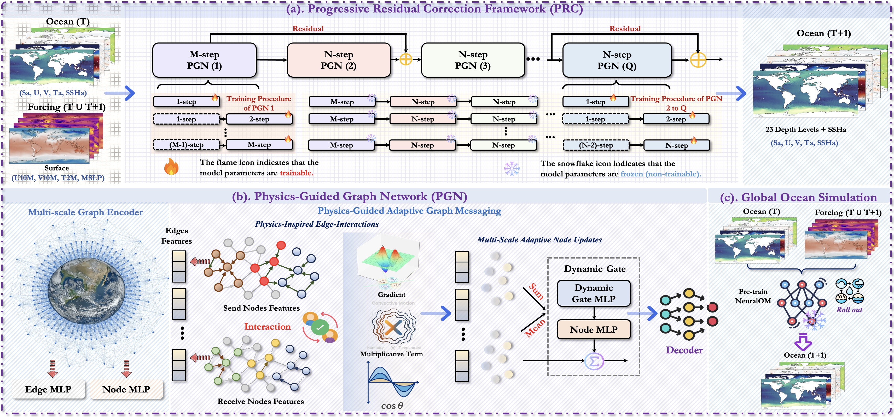
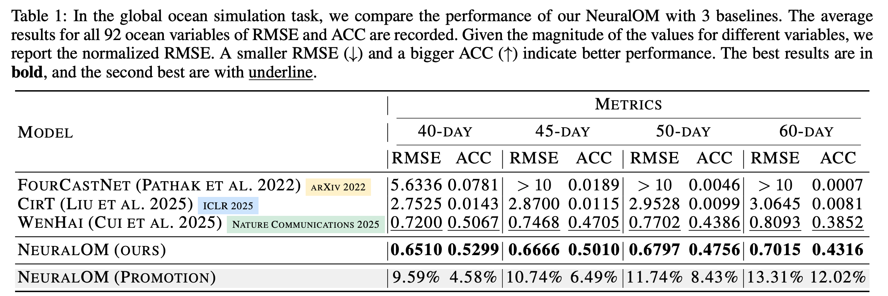

 
 # <p align=center> NeuralOM: Neural Ocean Model for Subseasonal-to-Seasonal Simulation</p>

 <div align="center">
 
[](https://arxiv.org/abs/2505.21020)

</div>
<div align=center>

</div>

---
>**NeuralOM: Neural Ocean Model for Subseasonal-to-Seasonal Simulation**<br>  [Yuan Gao](https://scholar.google.com.hk/citations?hl=zh-CN&user=4JpRnU4AAAAJ&view_op=list_works&sortby=pubdate)<sup>† </sup>, [Ruiqi Shu](https://scholar.google.com.hk/citations?user=WKBB3r0AAAAJ&hl=zh-CN&oi=sra)<sup>† </sup>, [Hao Wu](https://easylearningscores.github.io/)<sup>† </sup>,[Fan Xu](https://scholar.google.com.hk/citations?hl=zh-CN&user=qfMSkBgAAAAJ&view_op=list_works&sortby=pubdate), [Yanfei Xiang](https://orcid.org/0000-0002-5755-4114), [Ruijian Gou](https://scholar.google.com.hk/citations?user=YU7AZzQAAAAJ&hl=zh-CN), [Xian Wu](https://scholar.google.com.hk/citations?hl=zh-CN&user=lslB5jkAAAAJ&view_op=list_works&sortby=pubdate), [Qingsong Wen](https://sites.google.com/site/qingsongwen8/), [Xiaomeng Huang](http://faculty.dess.tsinghua.edu.cn/huangxiaomeng/en/index.htm)<sup>* </sup> <br>
(† Equal contribution, * Corresponding Author)<br>


> **Abstract:** *Accurate Subseasonal-to-Seasonal (S2S) ocean simulation is critically important for marine research, yet remains challenging due to its substantial thermal inertia and extended time delay. Machine learning (ML)-based models have demonstrated significant advancements in simulation accuracy and computational efficiency compared to traditional numerical methods. Nevertheless, a significant limitation of current ML models for S2S ocean simulation is their inadequate incorporation of physical consistency and the slow-changing properties of the ocean system. In this work, we propose a neural ocean model (NeuralOM) for S2S ocean simulation with a multi-scale interactive graph neural network to emulate diverse physical phenomena associated with ocean systems effectively. Specifically, we propose a multi-stage framework tailored to model the ocean's slowly changing nature. Additionally, we introduce a multi-scale interactive messaging module to capture complex dynamical behaviors, such as gradient changes and multiplicative coupling relationships inherent in ocean dynamics. Extensive experimental evaluations confirm that our proposed NeuralOM outperforms state-of-the-art models in S2S and extreme event simulation. The codes are available at \url{https://github.com/YuanGao-YG/NeuralOM}.*
---

## News 🚀
* **2025.06.01**: Codes for inference are released.
* **2025.05.27**: Paper is released on [ArXiv](https://arxiv.org/abs/2505.21020).

## Notes

The full project is avilable on [Hugging Face](https://huggingface.co/YuanGao-YG/NeuralOM/upload/main), you can find the pretrained model, test data on Hugging Face and put them in the same location.

## Quick Start

### Installation

- cuda 11.8

```
# git clone this repository
git clone https://github.com/YuanGao-YG/NeuralOM.git
cd NeuralOM

# create new anaconda env
conda env create -f environment.yml
conda activate neuralom
```


### Inference

```
sh inference.sh
```
   
## Training
**1. Prepare Data**

Preparing the train, valid, and test data as follows:

```
./data/
|--train
|  |--1993.h5
|  |--1994.h5
|  |--......
|  |--2016.h5
|  |--2017.h5
|--valid
|  |--2018.h5
|  |--2019.h5
|--test
|  |--2020.h5
|--mean_s_t_ssh.npy
|--std_s_t_ssh.npy
|--climate_mean_s_t_ssh.npy
|--land_mask.h5
```

Each h5 file includes a key named 'fields' with the shape [T, C, H, W] (T=365/366, C=97, H=360, W=720)

**2. Model Training**


- **Single GPU Training**
- **Single-node Multi-GPU Training**
- **Multi-node Multi-GPU Training**


## Performance
### Global Ocean Simulation

</div>
<div align=center>

</div>

</div>
<div align=center>

</div>


</div>
<div align=center>

</div>

### Extreme Event Assessment

</div>
<div align=center>

</div>

## Citation

```
@article{gao2025neuralom,
  title={NeuralOM: Neural Ocean Model for Subseasonal-to-Seasonal Simulation},
  author={Gao, Yuan and Shu, Ruiqi and Wu, Hao and Xu, Fan and Xiang, Yanfei and Gou, Ruijian and Wen, Qingsong and Wu, Xian and Huang, Xiaomeng},
  journal={arXiv preprint arXiv:2505.21020},
  year={2025}
}
```

#### If you have any questions, please contact [yuangao24@mails.tsinghua.edu.cn](mailto:yuangao24@mails.tsinghua.edu.cn), [srq24@mails.tsinghua.edu.cn](mailto:srq24@mails.tsinghua.edu.cn), [wuhao2022@mail.ustc.edu.cn](mailto:wuhao2022@mail.ustc.edu.cn).
