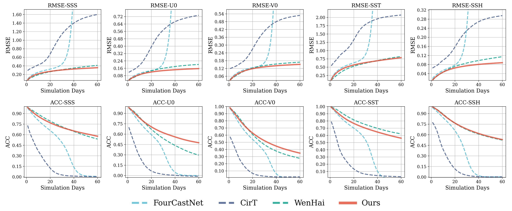

# <p align=center> NeuralOM: Neural Ocean Model for Subseasonal-to-Seasonal Simulation</p>

 <div align="center">
 
[](https://arxiv.org/abs/2505.21020)
[](https://huggingface.co/YuanGao-YG/NeuralOM/tree/main)

</div>
<div align=center>

</div>

---
>**NeuralOM: Neural Ocean Model for Subseasonal-to-Seasonal Simulation**<br>  [Yuan Gao](https://scholar.google.com.hk/citations?hl=zh-CN&user=4JpRnU4AAAAJ&view_op=list_works&sortby=pubdate)<sup>† </sup>, [Hao Wu](https://alexander-wu.github.io/)<sup>† </sup><sup>‡ </sup>,[Fan Xu](https://scholar.google.com.hk/citations?hl=zh-CN&user=qfMSkBgAAAAJ&view_op=list_works&sortby=pubdate), [Yanfei Xiang](https://orcid.org/0000-0002-5755-4114), [Ruijian Gou](https://scholar.google.com.hk/citations?user=YU7AZzQAAAAJ&hl=zh-CN), [Ruiqi Shu](https://scholar.google.com.hk/citations?user=WKBB3r0AAAAJ&hl=zh-CN&oi=sra), [Qingsong Wen](https://sites.google.com/site/qingsongwen8/), [Xian Wu](https://scholar.google.com.hk/citations?hl=zh-CN&user=lslB5jkAAAAJ&view_op=list_works&sortby=pubdate)<sup>* </sup>, [Kun Wang](https://scholar.google.com.hk/citations?user=UnyqjWQAAAAJ&hl=zh-CN)<sup>* </sup>, [Xiaomeng Huang](http://faculty.dess.tsinghua.edu.cn/huangxiaomeng/en/index.htm)<sup>* </sup> <br>
(† Equal contribution, ‡ Project lead and technical guidance, * Corresponding author)<br>


> **Abstract:** *Long-term, high-fidelity simulation of slow-changing physical systems, such as the ocean and climate, presents a fundamental challenge in scientific computing. Traditional autoregressive machine learning models often fail in these tasks as minor errors accumulate and lead to rapid forecast degradation. To address this problem, we propose NeuralOM, a general neural operator framework designed for simulating complex, slow-changing dynamics. NeuralOM's core consists of two key innovations: (1) a Progressive Residual Correction Framework that decomposes the forecasting task into a series of fine-grained refinement steps, effectively suppressing long-term error accumulation; and (2) a Physics-Guided Graph Network whose built-in adaptive messaging mechanism explicitly models multi-scale physical interactions, such as gradient-driven flows and multiplicative couplings, thereby enhancing physical consistency while maintaining computational efficiency. We validate NeuralOM on the challenging task of global Subseasonal-to-Seasonal (S2S) ocean simulation. Extensive experiments demonstrate that NeuralOM not only surpasses state-of-the-art models in forecast accuracy and long-term stability, but also excels in simulating extreme events. For instance, at a 60-day lead time, NeuralOM achieves a 13.3% lower RMSE compared to the best-performing baseline, offering a stable, efficient, and physically-aware paradigm for data-driven scientific computing. Code link: https://github.com/YuanGao-YG/NeuralOM.*
---

## News 🚀
* **2025.11.08**: NeuralOM is accepted by [AAAI 2026](https://aaai.org/conference/aaai/aaai-26/).
* **2025.07.28**: Inference codes for global ocean forecasting are released.
* **2025.06.01**: Inference codes for global ocean simulation are released.
* **2025.05.27**: Paper is released on [arXiv](https://arxiv.org/abs/2505.21020).

## Notes

The intact project is avilable on [Hugging Face](https://huggingface.co/YuanGao-YG/NeuralOM/tree/main), you can find the pretrained models, test data on Hugging Face and put them in the same location.

## Quick Start

### Installation

- cuda 11.8

```
# git clone this repository
git clone https://github.com/YuanGao-YG/NeuralOM.git
cd NeuralOM

# create new anaconda env
conda env create -f environment.yml
conda activate neuralom
```


### Inference for Global Ocean Simulation

Preparing the test data as follows:

```
./data/
|--test
|  |--2020.h5
|--mean_s_t_ssh.npy
|--std_s_t_ssh.npy
|--climate_mean_s_t_ssh.npy
|--land_mask.h5
```

Run the following script:

```
sh inference_simulation.sh
```

### Inference for Global Ocean Forecasting

Preparing the test data as follows:

```
./data/
|--test
|  |--2020.h5
|--test_atmos
|  |--2020.h5
|--mean_s_t_ssh.npy
|--std_s_t_ssh.npy
|--mean_atmos.npy
|--std_atmos.npy
|--climate_mean_s_t_ssh.npy
|--land_mask.h5
```

Run the following script:

```
sh inference_forecasting.sh
```

   
## Training

The training codes will be released after the paper is accepted.

**1. Prepare Data**

Preparing the train, valid, and test data as follows:

```
./data/
|--train
|  |--1993.h5
|  |--1994.h5
|  |--......
|  |--2016.h5
|  |--2017.h5
|--valid
|  |--2018.h5
|  |--2019.h5
|--test
|  |--2020.h5
|--mean_s_t_ssh.npy
|--std_s_t_ssh.npy
|--climate_mean_s_t_ssh.npy
|--land_mask.h5
```

For data ranging from 1993 to 2020, each h5 file includes a key named 'fields' with the shape [T, C, H, W] (T=365/366, C=97, H=361, W=720). The order of all variables is as follows:

```
var_idex = {
    "SSS": 0, "S2": 1, "S5": 2, "S7": 3, "S11": 4, "S15": 5, "S21": 6, "S29": 7, "S40": 8, "S55": 9, "S77": 10, "S92": 11, "S109": 12,
    "S130": 13, "S155": 14, "S186": 15, "S222": 16, "S266": 17, "S318": 18, "S380": 19, "S453": 20, "S541": 21, "S643": 22,
    "U0": 23, "U2": 24, "U5": 25, "U7": 26, "U11": 27, "U15": 28, "U21": 29, "U29": 30, "U40": 31, "U55": 32, "U77": 33, "U92": 34, "U109": 35,
    "U130": 36, "U155": 37, "U186": 38, "U222": 39, "U266": 40, "U318": 41, "U380": 42, "U453": 43, "U541": 44, "U643": 45,
    "V0": 46, "V2": 47, "V5": 48, "V7": 49, "V11": 50, "V15": 51, "V21": 52, "V29": 53, "V40": 54, "V55": 55, "V77": 56, "V92": 57, "V109": 58,
    "V130": 59, "V155": 60, "V186": 61, "V222": 62, "V266": 63, "V318": 64, "V380": 65, "V453": 66, "V541": 67, "V643": 68,
    "SST": 69, "T2": 70, "T5": 71, "T7": 72, "T11": 73, "T15": 74, "T21": 75, "T29": 76, "T40": 77, "T55": 78, "T77": 79, "T92": 80, "T109": 81,
    "T130": 82, "T155": 83, "T186": 84, "T222": 85, "T266": 86, "T318": 87, "T380": 88, "T453": 89, "T541": 90, "T643": 91,
    "SSH": 92,
   
}
```
Regarding the meaning of abbreviated variables, for example, "SSS" means sea surface salinity and "S2" means salinity at 2 m.


**2. Model Training**


- **Single GPU Training**
  
  Continue update
- **Single-node Multi-GPU Training**

  Continue update
- **Multi-node Multi-GPU Training**

  Continue update


## Performance
### Global Ocean Simulation

</div>
<div align=center>

</div>

</div>
<div align=center>

</div>


</div>
<div align=center>

</div>

### Global Ocean Forecasting and Extreme Event Assessment

</div>
<div align=center>

</div>

## Citation

```
@article{gao2025neuralom,
  title={NeuralOM: Neural Ocean Model for Subseasonal-to-Seasonal Simulation},
  author={Gao, Yuan and Shu, Ruiqi and Wu, Hao and Xu, Fan and Xiang, Yanfei and Gou, Ruijian and Wen, Qingsong and Wu, Xian and Wang, Kun and Huang, Xiaomeng},
  journal={arXiv preprint arXiv:2505.21020},
  year={2025}
}
```

## Acknowledgement

We appreciate the following open-sourced repositories for their valuable code base:

[https://github.com/NVlabs/FourCastNet](https://github.com/NVlabs/FourCastNet)

[https://github.com/NVIDIA/physicsnemo](https://github.com/NVIDIA/physicsnemo)


#### If you have any questions, please contact [yuangao24@mails.tsinghua.edu.cn](mailto:yuangao24@mails.tsinghua.edu.cn), [wuhao2022@mail.ustc.edu.cn](mailto:wuhao2022@mail.ustc.edu.cn).
